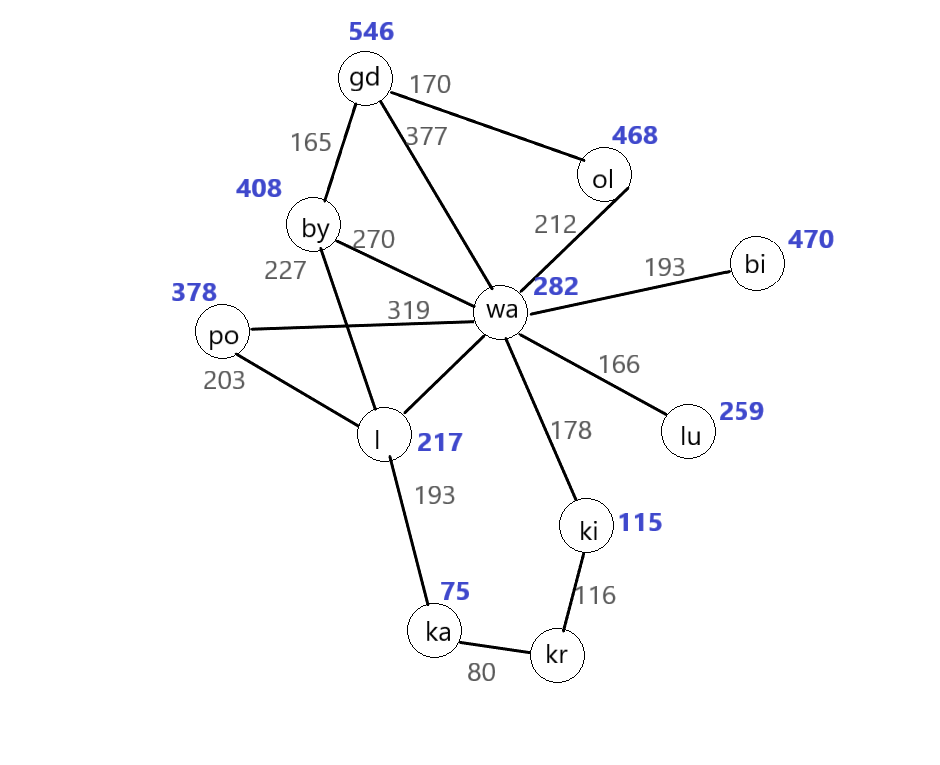

# JPS
## Odpalenie programu
Najpierw należy wczytać jeden z plików z katalogu zawierającego przestrzenie stanów, a potem plik **A_Star.pl**
## Przykładowe wywołania programu
### Domyślna przestrzeń stanów
**start_A_star(a, PathCost, 3, 4).**
### Mapa drogowa
**start_A_star(gd, PathCost, 3, 4).**
### Tablica ósemkowa
**start_A_star([pos(0,1/2), pos(1,1/3), pos(2,2/3), pos(3,3/3), pos(4,3/1), pos(5,2/2), pos(6,3/2), pos(7,1/1), pos(8,2/1)], PathCost, 1, 100).**
## Przestrzeń stanów (mapa drogowa):

